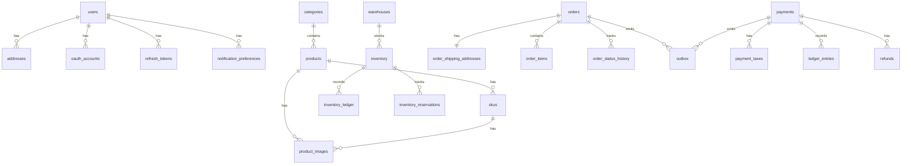

# Ecommerce Microservices — Database Schema

All tables use UUID v4 primary keys, soft deletes (`deleted_at`), and audit columns (`created_at`, `updated_at`). Each service owns its own PostgreSQL database — no cross-database foreign keys.

---

## Conventions

- `id UUID PRIMARY KEY DEFAULT gen_random_uuid()` — requires PostgreSQL `pgcrypto`
- Every table has `created_at`, `updated_at`, `deleted_at`
- Monetary values stored as `BIGINT` (smallest currency unit — paise for INR, cents for USD)
- Currency stored as `CHAR(3)` ISO 4217 code (e.g. `INR`, `USD`)
- Enums defined as `VARCHAR` with a `CHECK` constraint — easier to migrate than Postgres native enums

---

## 1. User / Auth Service

```sql
-- Stores registered users
CREATE TABLE users (
    id             UUID         PRIMARY KEY DEFAULT gen_random_uuid(),
    email          VARCHAR(255) NOT NULL UNIQUE,
    phone          VARCHAR(20),
    password_hash  TEXT,                            -- null for OAuth-only accounts
    full_name      VARCHAR(255),
    role           VARCHAR(50)  NOT NULL DEFAULT 'customer'
                   CHECK (role IN ('customer', 'seller', 'admin')),
    is_verified    BOOLEAN      NOT NULL DEFAULT FALSE,
    created_at     TIMESTAMPTZ  NOT NULL DEFAULT NOW(),
    updated_at     TIMESTAMPTZ  NOT NULL DEFAULT NOW(),
    deleted_at     TIMESTAMPTZ
);

CREATE INDEX idx_users_email ON users (email) WHERE deleted_at IS NULL;
CREATE INDEX idx_users_phone ON users (phone) WHERE deleted_at IS NULL;


-- OAuth provider links (Google, Facebook, etc.)
CREATE TABLE oauth_accounts (
    id           UUID         PRIMARY KEY DEFAULT gen_random_uuid(),
    user_id      UUID         NOT NULL REFERENCES users (id),
    provider     VARCHAR(50)  NOT NULL,             -- 'google', 'facebook'
    provider_uid VARCHAR(255) NOT NULL,
    created_at   TIMESTAMPTZ  NOT NULL DEFAULT NOW(),
    updated_at   TIMESTAMPTZ  NOT NULL DEFAULT NOW(),
    deleted_at   TIMESTAMPTZ,
    UNIQUE (provider, provider_uid)
);


-- Refresh tokens (one row per issued token)
CREATE TABLE refresh_tokens (
    id          UUID        PRIMARY KEY DEFAULT gen_random_uuid(),
    user_id     UUID        NOT NULL REFERENCES users (id),
    token_hash  TEXT        NOT NULL UNIQUE,        -- SHA-256 of the raw token
    expires_at  TIMESTAMPTZ NOT NULL,
    revoked_at  TIMESTAMPTZ,
    created_at  TIMESTAMPTZ NOT NULL DEFAULT NOW(),
    updated_at  TIMESTAMPTZ NOT NULL DEFAULT NOW(),
    deleted_at  TIMESTAMPTZ
);

CREATE INDEX idx_refresh_tokens_user ON refresh_tokens (user_id) WHERE revoked_at IS NULL;


-- User addresses (shipping / billing)
CREATE TABLE addresses (
    id         UUID         PRIMARY KEY DEFAULT gen_random_uuid(),
    user_id    UUID         NOT NULL REFERENCES users (id),
    label      VARCHAR(50),                         -- 'home', 'office'
    line1      TEXT         NOT NULL,
    line2      TEXT,
    city       VARCHAR(100) NOT NULL,
    state      VARCHAR(100) NOT NULL,
    country    CHAR(2)      NOT NULL DEFAULT 'IN',
    pincode    VARCHAR(20)  NOT NULL,
    is_default BOOLEAN      NOT NULL DEFAULT FALSE,
    created_at TIMESTAMPTZ  NOT NULL DEFAULT NOW(),
    updated_at TIMESTAMPTZ  NOT NULL DEFAULT NOW(),
    deleted_at TIMESTAMPTZ
);

CREATE INDEX idx_addresses_user ON addresses (user_id) WHERE deleted_at IS NULL;


-- Notification preferences (owned by User service)
CREATE TABLE notification_preferences (
    id         UUID         PRIMARY KEY DEFAULT gen_random_uuid(),
    user_id    UUID         NOT NULL REFERENCES users (id),
    channel    VARCHAR(50)  NOT NULL CHECK (channel IN ('email', 'sms', 'push')),
    event_type VARCHAR(100) NOT NULL,               -- e.g. 'order.created'
    enabled    BOOLEAN      NOT NULL DEFAULT TRUE,
    created_at TIMESTAMPTZ  NOT NULL DEFAULT NOW(),
    updated_at TIMESTAMPTZ  NOT NULL DEFAULT NOW(),
    deleted_at TIMESTAMPTZ,
    UNIQUE (user_id, channel, event_type)
);
```

---

## 2. Product Catalog Service

```sql
-- Top-level product categories (self-referential tree)
CREATE TABLE categories (
    id         UUID         PRIMARY KEY DEFAULT gen_random_uuid(),
    parent_id  UUID         REFERENCES categories (id),
    name       VARCHAR(255) NOT NULL,
    slug       VARCHAR(255) NOT NULL UNIQUE,
    created_at TIMESTAMPTZ  NOT NULL DEFAULT NOW(),
    updated_at TIMESTAMPTZ  NOT NULL DEFAULT NOW(),
    deleted_at TIMESTAMPTZ
);


-- A product is the top-level item (e.g. "Nike Air Max 90")
CREATE TABLE products (
    id          UUID         PRIMARY KEY DEFAULT gen_random_uuid(),
    category_id UUID         NOT NULL REFERENCES categories (id),
    seller_id   UUID         NOT NULL,              -- logical FK to users.id (seller role)
    name        VARCHAR(500) NOT NULL,
    slug        VARCHAR(500) NOT NULL UNIQUE,
    description TEXT,
    attributes  JSONB        NOT NULL DEFAULT '{}', -- flexible per-category attrs
    status      VARCHAR(50)  NOT NULL DEFAULT 'draft'
                CHECK (status IN ('draft', 'active', 'archived')),
    created_at  TIMESTAMPTZ  NOT NULL DEFAULT NOW(),
    updated_at  TIMESTAMPTZ  NOT NULL DEFAULT NOW(),
    deleted_at  TIMESTAMPTZ
);

CREATE INDEX idx_products_category ON products (category_id) WHERE deleted_at IS NULL;
CREATE INDEX idx_products_seller   ON products (seller_id)   WHERE deleted_at IS NULL;
CREATE INDEX idx_products_status   ON products (status)      WHERE deleted_at IS NULL;
CREATE INDEX idx_products_attrs    ON products USING GIN (attributes);


-- A SKU is a specific purchasable variant of a product
-- e.g. "Nike Air Max 90 — Size 10 / Black"
CREATE TABLE skus (
    id            UUID         PRIMARY KEY DEFAULT gen_random_uuid(),
    product_id    UUID         NOT NULL REFERENCES products (id),
    sku_code      VARCHAR(100) NOT NULL UNIQUE,
    variant_attrs JSONB        NOT NULL DEFAULT '{}', -- {"size": "10", "color": "black"}
    price_amount  BIGINT       NOT NULL,              -- in paise / cents
    currency      CHAR(3)      NOT NULL DEFAULT 'INR',
    compare_price BIGINT,                             -- original price for strikethrough
    weight_grams  INT,
    is_active     BOOLEAN      NOT NULL DEFAULT TRUE,
    created_at    TIMESTAMPTZ  NOT NULL DEFAULT NOW(),
    updated_at    TIMESTAMPTZ  NOT NULL DEFAULT NOW(),
    deleted_at    TIMESTAMPTZ
);

CREATE INDEX idx_skus_product ON skus (product_id) WHERE deleted_at IS NULL;


-- Product images
CREATE TABLE product_images (
    id         UUID        PRIMARY KEY DEFAULT gen_random_uuid(),
    product_id UUID        NOT NULL REFERENCES products (id),
    sku_id     UUID        REFERENCES skus (id),     -- null = applies to all variants
    url        TEXT        NOT NULL,
    position   SMALLINT    NOT NULL DEFAULT 0,
    created_at TIMESTAMPTZ NOT NULL DEFAULT NOW(),
    updated_at TIMESTAMPTZ NOT NULL DEFAULT NOW(),
    deleted_at TIMESTAMPTZ
);
```

---

## 3. Inventory Service

```sql
-- Physical warehouses
CREATE TABLE warehouses (
    id         UUID         PRIMARY KEY DEFAULT gen_random_uuid(),
    name       VARCHAR(255) NOT NULL,
    city       VARCHAR(100) NOT NULL,
    state      VARCHAR(100) NOT NULL,
    pincode    VARCHAR(20)  NOT NULL,
    is_active  BOOLEAN      NOT NULL DEFAULT TRUE,
    created_at TIMESTAMPTZ  NOT NULL DEFAULT NOW(),
    updated_at TIMESTAMPTZ  NOT NULL DEFAULT NOW(),
    deleted_at TIMESTAMPTZ
);


-- Stock per SKU per warehouse
-- This is the hot row — all reservation math happens here
CREATE TABLE inventory (
    id                  UUID    PRIMARY KEY DEFAULT gen_random_uuid(),
    sku_id              UUID    NOT NULL,            -- logical FK to skus.id in product DB
    warehouse_id        UUID    NOT NULL REFERENCES warehouses (id),
    qty_on_hand         INT     NOT NULL DEFAULT 0 CHECK (qty_on_hand >= 0),
    qty_reserved        INT     NOT NULL DEFAULT 0 CHECK (qty_reserved >= 0),
    qty_available       INT     GENERATED ALWAYS AS (qty_on_hand - qty_reserved) STORED,
    low_stock_threshold INT     NOT NULL DEFAULT 10,
    created_at          TIMESTAMPTZ NOT NULL DEFAULT NOW(),
    updated_at          TIMESTAMPTZ NOT NULL DEFAULT NOW(),
    deleted_at          TIMESTAMPTZ,
    UNIQUE (sku_id, warehouse_id)
);

CREATE INDEX idx_inventory_sku       ON inventory (sku_id)       WHERE deleted_at IS NULL;
CREATE INDEX idx_inventory_warehouse ON inventory (warehouse_id) WHERE deleted_at IS NULL;


-- Every stock movement recorded here (immutable append-only ledger)
CREATE TABLE inventory_ledger (
    id            UUID        PRIMARY KEY DEFAULT gen_random_uuid(),
    inventory_id  UUID        NOT NULL REFERENCES inventory (id),
    order_id      UUID,                              -- null for manual adjustments
    movement_type VARCHAR(50) NOT NULL
                  CHECK (movement_type IN (
                      'purchase_order',
                      'reservation',
                      'reservation_release',
                      'sale',
                      'return',
                      'adjustment'
                  )),
    qty_delta     INT         NOT NULL,              -- positive = in, negative = out
    qty_before    INT         NOT NULL,
    qty_after     INT         NOT NULL,
    note          TEXT,
    created_at    TIMESTAMPTZ NOT NULL DEFAULT NOW()
    -- immutable — no updated_at / deleted_at
);

CREATE INDEX idx_ledger_inventory ON inventory_ledger (inventory_id);
CREATE INDEX idx_ledger_order     ON inventory_ledger (order_id) WHERE order_id IS NOT NULL;


-- Active reservations tied to an order
CREATE TABLE inventory_reservations (
    id           UUID        PRIMARY KEY DEFAULT gen_random_uuid(),
    inventory_id UUID        NOT NULL REFERENCES inventory (id),
    order_id     UUID        NOT NULL,
    sku_id       UUID        NOT NULL,
    qty          INT         NOT NULL CHECK (qty > 0),
    status       VARCHAR(50) NOT NULL DEFAULT 'reserved'
                 CHECK (status IN ('reserved', 'confirmed', 'released')),
    expires_at   TIMESTAMPTZ NOT NULL,               -- TTL for abandoned cart cleanup
    created_at   TIMESTAMPTZ NOT NULL DEFAULT NOW(),
    updated_at   TIMESTAMPTZ NOT NULL DEFAULT NOW(),
    deleted_at   TIMESTAMPTZ
);

CREATE INDEX idx_reservations_order   ON inventory_reservations (order_id);
CREATE INDEX idx_reservations_expires ON inventory_reservations (expires_at)
    WHERE status = 'reserved';
```

---

## 4. Order Service

```sql
-- One row per customer order
CREATE TABLE orders (
    id                  UUID        PRIMARY KEY DEFAULT gen_random_uuid(),
    user_id             UUID        NOT NULL,
    status              VARCHAR(50) NOT NULL DEFAULT 'pending'
                        CHECK (status IN (
                            'pending',
                            'confirmed',
                            'processing',
                            'shipped',
                            'delivered',
                            'cancelled',
                            'refunded'
                        )),
    subtotal_amount     BIGINT      NOT NULL,
    discount_amount     BIGINT      NOT NULL DEFAULT 0,
    shipping_amount     BIGINT      NOT NULL DEFAULT 0,
    tax_amount          BIGINT      NOT NULL DEFAULT 0,
    total_amount        BIGINT      NOT NULL,
    currency            CHAR(3)     NOT NULL DEFAULT 'INR',
    idempotency_key     UUID        NOT NULL UNIQUE, -- client-supplied, prevents duplicate orders
    notes               TEXT,
    created_at          TIMESTAMPTZ NOT NULL DEFAULT NOW(),
    updated_at          TIMESTAMPTZ NOT NULL DEFAULT NOW(),
    deleted_at          TIMESTAMPTZ
);

CREATE INDEX idx_orders_user   ON orders (user_id) WHERE deleted_at IS NULL;
CREATE INDEX idx_orders_status ON orders (status)  WHERE deleted_at IS NULL;


-- Snapshot of shipping address at order time
-- Stored here so address book changes don't affect historical orders
CREATE TABLE order_shipping_addresses (
    id         UUID         PRIMARY KEY DEFAULT gen_random_uuid(),
    order_id   UUID         NOT NULL UNIQUE REFERENCES orders (id),
    line1      TEXT         NOT NULL,
    line2      TEXT,
    city       VARCHAR(100) NOT NULL,
    state      VARCHAR(100) NOT NULL,
    country    CHAR(2)      NOT NULL DEFAULT 'IN',
    pincode    VARCHAR(20)  NOT NULL,
    created_at TIMESTAMPTZ  NOT NULL DEFAULT NOW(),
    updated_at TIMESTAMPTZ  NOT NULL DEFAULT NOW(),
    deleted_at TIMESTAMPTZ
);


-- One row per SKU line in an order
CREATE TABLE order_items (
    id            UUID         PRIMARY KEY DEFAULT gen_random_uuid(),
    order_id      UUID         NOT NULL REFERENCES orders (id),
    sku_id        UUID         NOT NULL,
    sku_code      VARCHAR(100) NOT NULL,             -- snapshot at order time
    product_name  VARCHAR(500) NOT NULL,             -- snapshot
    variant_attrs JSONB        NOT NULL DEFAULT '{}',-- snapshot
    qty           INT          NOT NULL CHECK (qty > 0),
    unit_price    BIGINT       NOT NULL,             -- snapshot price in paise
    discount      BIGINT       NOT NULL DEFAULT 0,
    total_price   BIGINT       NOT NULL,
    currency      CHAR(3)      NOT NULL DEFAULT 'INR',
    created_at    TIMESTAMPTZ  NOT NULL DEFAULT NOW(),
    updated_at    TIMESTAMPTZ  NOT NULL DEFAULT NOW(),
    deleted_at    TIMESTAMPTZ
);

CREATE INDEX idx_order_items_order ON order_items (order_id);
CREATE INDEX idx_order_items_sku   ON order_items (sku_id);


-- Every status transition recorded for audit / support
CREATE TABLE order_status_history (
    id          UUID        PRIMARY KEY DEFAULT gen_random_uuid(),
    order_id    UUID        NOT NULL REFERENCES orders (id),
    from_status VARCHAR(50),
    to_status   VARCHAR(50) NOT NULL,
    reason      TEXT,
    changed_by  UUID,                               -- user_id or null for system
    created_at  TIMESTAMPTZ NOT NULL DEFAULT NOW()
    -- immutable — no updated_at / deleted_at
);

CREATE INDEX idx_status_history_order ON order_status_history (order_id);


-- Transactional outbox — Debezium reads this via CDC and publishes to Kafka
CREATE TABLE outbox (
    id             UUID         PRIMARY KEY DEFAULT gen_random_uuid(),
    aggregate_id   UUID         NOT NULL,            -- e.g. order_id
    aggregate_type VARCHAR(100) NOT NULL,            -- e.g. 'order'
    event_type     VARCHAR(100) NOT NULL,            -- e.g. 'order.created'
    payload        JSONB        NOT NULL,
    published_at   TIMESTAMPTZ,                      -- set after Debezium publishes
    created_at     TIMESTAMPTZ  NOT NULL DEFAULT NOW()
);

CREATE INDEX idx_outbox_unpublished ON outbox (created_at) WHERE published_at IS NULL;
```

---

## 5. Payment Service

```sql
-- One payment attempt per order
-- An order can have multiple rows here (retries, failed attempts)
CREATE TABLE payments (
    id               UUID         PRIMARY KEY DEFAULT gen_random_uuid(),
    order_id         UUID         NOT NULL,
    user_id          UUID         NOT NULL,
    idempotency_key  UUID         NOT NULL UNIQUE,
    status           VARCHAR(50)  NOT NULL DEFAULT 'pending'
                     CHECK (status IN (
                         'pending',
                         'authorised',
                         'captured',
                         'failed',
                         'refunded',
                         'partially_refunded'
                     )),
    amount           BIGINT       NOT NULL,          -- in paise
    currency         CHAR(3)      NOT NULL DEFAULT 'INR',
    gateway          VARCHAR(50)  NOT NULL,          -- 'razorpay', 'stripe'
    gateway_txn_id   VARCHAR(255) UNIQUE,            -- PG's transaction reference
    gateway_response JSONB,                          -- raw PG response for debugging
    failure_reason   TEXT,
    created_at       TIMESTAMPTZ  NOT NULL DEFAULT NOW(),
    updated_at       TIMESTAMPTZ  NOT NULL DEFAULT NOW(),
    deleted_at       TIMESTAMPTZ
);

CREATE INDEX idx_payments_order  ON payments (order_id);
CREATE INDEX idx_payments_status ON payments (status) WHERE deleted_at IS NULL;


-- GST breakdown per payment
CREATE TABLE payment_taxes (
    id          UUID        PRIMARY KEY DEFAULT gen_random_uuid(),
    payment_id  UUID        NOT NULL REFERENCES payments (id),
    tax_type    VARCHAR(50) NOT NULL CHECK (tax_type IN ('CGST', 'SGST', 'IGST', 'CESS')),
    rate_bps    INT         NOT NULL,                -- basis points, e.g. 900 = 9%
    base_amount BIGINT      NOT NULL,                -- taxable amount in paise
    tax_amount  BIGINT      NOT NULL,
    created_at  TIMESTAMPTZ NOT NULL DEFAULT NOW(),
    updated_at  TIMESTAMPTZ NOT NULL DEFAULT NOW(),
    deleted_at  TIMESTAMPTZ
);


-- Double-entry ledger — every money movement has two rows (debit + credit)
CREATE TABLE ledger_entries (
    id         UUID         PRIMARY KEY DEFAULT gen_random_uuid(),
    payment_id UUID         NOT NULL REFERENCES payments (id),
    entry_type VARCHAR(50)  NOT NULL CHECK (entry_type IN ('debit', 'credit')),
    account    VARCHAR(100) NOT NULL,                -- 'revenue', 'gst_payable', 'refund'
    amount     BIGINT       NOT NULL CHECK (amount > 0),
    currency   CHAR(3)      NOT NULL DEFAULT 'INR',
    description TEXT,
    created_at TIMESTAMPTZ  NOT NULL DEFAULT NOW()
    -- immutable — no updated_at / deleted_at
);

CREATE INDEX idx_ledger_payment ON ledger_entries (payment_id);
CREATE INDEX idx_ledger_account ON ledger_entries (account);


-- Refunds linked to a captured payment
CREATE TABLE refunds (
    id                UUID        PRIMARY KEY DEFAULT gen_random_uuid(),
    payment_id        UUID        NOT NULL REFERENCES payments (id),
    order_id          UUID        NOT NULL,
    amount            BIGINT      NOT NULL,
    currency          CHAR(3)     NOT NULL DEFAULT 'INR',
    reason            VARCHAR(255),
    status            VARCHAR(50) NOT NULL DEFAULT 'pending'
                      CHECK (status IN ('pending', 'processed', 'failed')),
    gateway_refund_id VARCHAR(255),
    created_at        TIMESTAMPTZ NOT NULL DEFAULT NOW(),
    updated_at        TIMESTAMPTZ NOT NULL DEFAULT NOW(),
    deleted_at        TIMESTAMPTZ
);

CREATE INDEX idx_refunds_payment ON refunds (payment_id);
CREATE INDEX idx_refunds_order   ON refunds (order_id);


-- Outbox for payment events (same Debezium CDC pattern as order service)
CREATE TABLE outbox (
    id             UUID         PRIMARY KEY DEFAULT gen_random_uuid(),
    aggregate_id   UUID         NOT NULL,
    aggregate_type VARCHAR(100) NOT NULL,
    event_type     VARCHAR(100) NOT NULL,
    payload        JSONB        NOT NULL,
    published_at   TIMESTAMPTZ,
    created_at     TIMESTAMPTZ  NOT NULL DEFAULT NOW()
);

CREATE INDEX idx_outbox_unpublished ON outbox (created_at) WHERE published_at IS NULL;
```

---

## 6. Notification Service

Notification service is stateless — no primary database. It consumes Kafka events and dispatches via external providers (SendGrid, Twilio, FCM). All state lives in Redis.

| Key pattern | Purpose | TTL |
|-------------|---------|-----|
| `notif:dedup:{event_id}` | Prevent duplicate sends | 24h |
| `notif:ratelimit:{user_id}:{channel}` | Per-user rate limit counter | 1h |
| `notif:pref:{user_id}` | Cached notification preferences | 30m |

Notification preferences are persisted in the User service DB via the `notification_preferences` table defined in section 1.

---

## Entity Relationship Summary



---

## Key Design Notes

**Monetary values as BIGINT**
All prices stored in the smallest currency unit (paise for INR, cents for USD). No floating point — avoids rounding errors entirely. `1299` means ₹12.99.

**Price snapshots in order_items**
`product_name`, `variant_attrs`, and `unit_price` are copied into `order_items` at order creation time. Seller price changes never corrupt historical order data.

**Address snapshot in orders**
`order_shipping_addresses` is a point-in-time copy, not a foreign key to `addresses`. Users can update their address book without affecting old orders.

**Generated column for available qty**
`qty_available` in `inventory` uses `GENERATED ALWAYS AS (qty_on_hand - qty_reserved) STORED`. Always consistent — no application logic needed to keep it in sync.

**Immutable ledger rows**
`inventory_ledger` and `ledger_entries` have no `updated_at` or `deleted_at`. They are append-only. Corrections are made by inserting a new offsetting row, never by updating an existing one.

**GST in basis points**
`rate_bps = 900` means 9%. Avoids decimal storage for tax rates. CGST + SGST applies for intra-state transactions; IGST applies for inter-state.

**Outbox in both Order and Payment**
Each service has its own `outbox` table. Debezium runs a separate connector per service DB, ensuring events are published atomically with the business write.

**No cross-service foreign keys**
`seller_id` in `products`, `sku_id` in `inventory`, and `order_id` in `payments` are UUIDs with no enforced FK constraints. Referential integrity across service boundaries is maintained at the application layer, not the DB layer.
