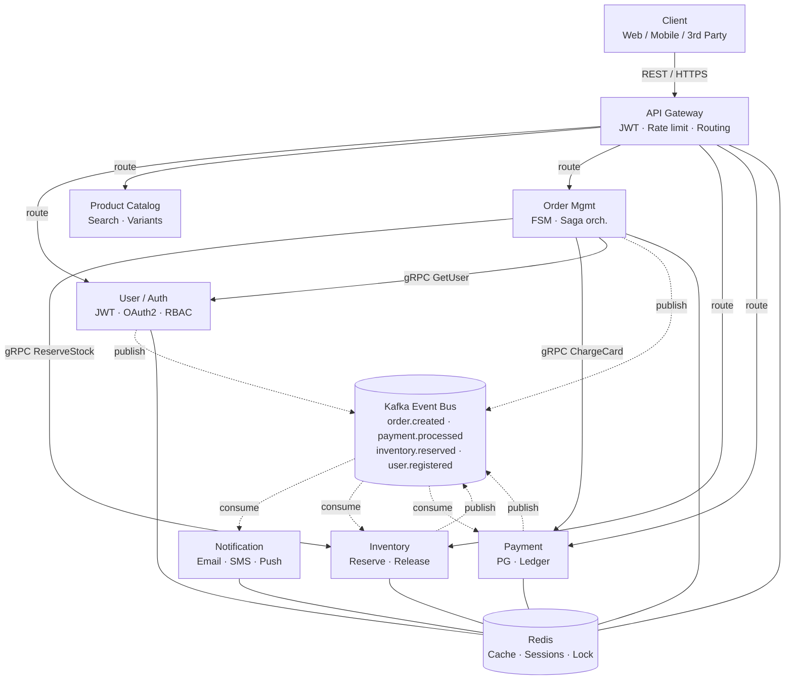
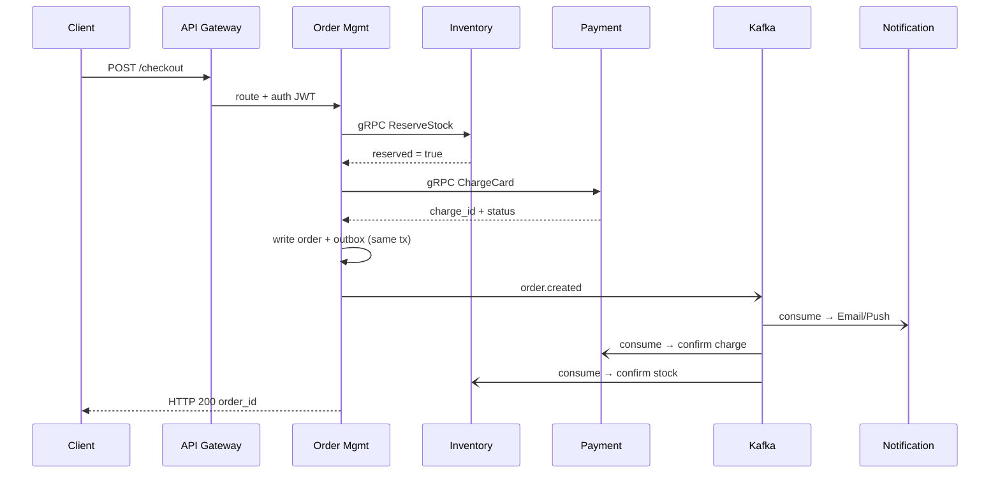
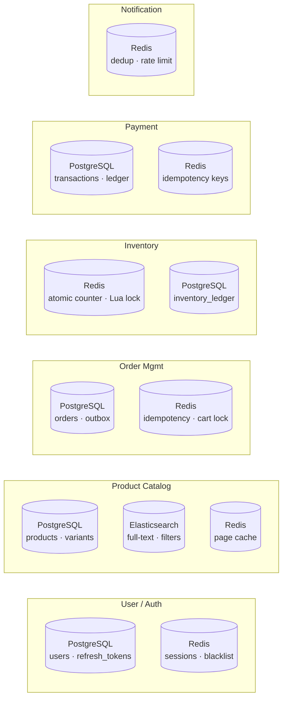

# Ecommerce Microservices Architecture

Six services communicating via gRPC (sync) and Kafka (async), with Redis for caching, locking, and idempotency. Each service owns its own database — no cross-service joins.

---

## Overview



---

## Services

### User / Auth
- Issues and validates JWTs (OAuth2 + password flows)
- RBAC roles stored per user
- Other services call it via gRPC to validate tokens in the hot path
- **DB:** PostgreSQL (`users`, `refresh_tokens`)
- **Cache:** Redis — session store, token blacklist

### Product Catalog
- Manages products, variants, categories, and pricing rules
- PostgreSQL as the source of truth; Debezium CDC syncs changes to Elasticsearch
- Redis caches catalogue listing pages
- **DB:** PostgreSQL (`products`, `variants`, `categories`)
- **Search:** Elasticsearch — full-text + faceted filters
- **Cache:** Redis — product page cache

### Order Management
- Owns the order lifecycle FSM: `pending → confirmed → shipped → delivered → cancelled`
- Acts as the saga orchestrator — calls Inventory and Payment via gRPC
- Writes to a transactional outbox table; Debezium CDC publishes events to Kafka
- **DB:** PostgreSQL (`orders`, `outbox`)
- **Cache:** Redis — idempotency keys, cart lock
- **Publishes:** `order.created`, `order.cancelled`

### Inventory
- Tracks stock per SKU and warehouse
- Reservations use atomic Lua scripts in Redis (`DECRBY` + guard) to prevent oversell
- PostgreSQL `inventory_ledger` is the durable audit trail
- Listens on `order.cancelled` to release reserved stock
- **DB:** PostgreSQL (`inventory_ledger`)
- **Cache:** Redis — atomic stock counters, distributed lock
- **Consumes:** `order.cancelled`
- **Publishes:** `inventory.reserved`, `inventory.updated`

### Payment
- Integrates with payment gateway (Razorpay / Stripe)
- All charges are idempotent — idempotency keys in Redis prevent double charges on retry
- Double-entry ledger rows written to PostgreSQL on each transaction
- **DB:** PostgreSQL (`transactions`, `ledger_entries`)
- **Cache:** Redis — idempotency keys
- **Consumes:** `order.created`
- **Publishes:** `payment.processed`, `payment.failed`

### Notification
- Purely event-driven — no REST endpoints exposed
- Stateless consumer; dispatches Email / SMS / Push via provider SDKs
- Redis handles per-user rate limiting and event deduplication
- **No primary DB**
- **Cache:** Redis — dedup keys, rate limit counters
- **Consumes:** `order.created`, `payment.processed`, `shipment.updated`

---

## Communication Patterns

### gRPC (synchronous, internal)

| Caller | Callee | RPC |
|--------|--------|-----|
| API Gateway | User / Auth | `ValidateToken` |
| Order Mgmt | Inventory | `ReserveStock` |
| Order Mgmt | Payment | `ChargeCard` |
| Order Mgmt | User / Auth | `GetUser` |

All proto definitions live in a shared `proto/` repo. Services generate client stubs at build time.

### Kafka topics

| Topic | Producer | Consumers |
|-------|----------|-----------|
| `order.created` | Order Mgmt | Payment, Notification, Inventory |
| `order.cancelled` | Order Mgmt | Inventory, Notification |
| `payment.processed` | Payment | Order Mgmt, Notification |
| `payment.failed` | Payment | Order Mgmt, Notification |
| `inventory.reserved` | Inventory | Order Mgmt |
| `inventory.updated` | Inventory | Analytics |
| `user.registered` | User / Auth | Notification |

Retention: 7 days minimum. Each service has its own consumer group.

---

## Checkout Saga Flow



**Compensating transactions on failure:**
- Payment fails → Order publishes `order.cancelled` → Inventory releases reserved stock
- Inventory reservation fails → Order returns error immediately, no payment attempted

---

## Data Stores Per Service



### Store assignments

| Service | Primary DB | Secondary |
|---------|-----------|-----------|
| User / Auth | PostgreSQL | Redis (sessions, blacklist) |
| Product Catalog | PostgreSQL | Elasticsearch, Redis |
| Order Mgmt | PostgreSQL | Redis (idempotency, cart lock) |
| Inventory | PostgreSQL | Redis (atomic counters, Lua lock) |
| Payment | PostgreSQL | Redis (idempotency keys) |
| Notification | None | Redis (dedup, rate limit) |

**Rule:** No service reads another service's database directly. Cross-service data access goes through gRPC or Kafka only.

---

## Redis Usage Breakdown

Redis is a shared cluster with per-service keyspace prefixes to avoid collisions.

| Use case | Service | Pattern |
|----------|---------|---------|
| JWT session store | User / Auth | `SET auth:session:{token} {payload} EX 3600` |
| Token blacklist | User / Auth | `SET auth:blacklist:{jti} 1 EX {ttl}` |
| Idempotency keys | Order, Payment | `SET {svc}:idem:{key} {result} EX 86400 NX` |
| Atomic stock reserve | Inventory | Lua script: `DECRBY inv:stock:{sku} qty` with guard |
| Distributed lock | Inventory | Redlock on `inv:lock:{sku}` |
| Product page cache | Product | `SET product:page:{id} {json} EX 300` |
| Cart data | Order | `HSET order:cart:{user_id} {items}` |
| Notification dedup | Notification | `SET notif:dedup:{event_id} 1 EX 3600 NX` |

---

## API Gateway

- Single public ingress — no service is directly internet-reachable
- Validates JWT on every request (gRPC call to User / Auth or local Redis cache of valid tokens)
- Per-user and per-IP rate limiting via Redis counters
- Routes by path prefix: `/users/*` → User, `/products/*` → Product, `/orders/*` → Order
- Can be implemented with Kong, Envoy, or Nginx + Lua

---

## Project Structure (Go monorepo)

```
/
├── proto/                        # Shared .proto definitions
│   ├── user/v1/user.proto
│   ├── inventory/v1/inventory.proto
│   └── payment/v1/payment.proto
│
├── services/
│   ├── user/
│   │   ├── cmd/main.go
│   │   ├── internal/
│   │   │   ├── handler/          # gRPC handlers
│   │   │   ├── repository/       # DB layer
│   │   │   └── service/          # Business logic
│   │   └── Dockerfile
│   ├── product/
│   ├── order/
│   ├── inventory/
│   ├── payment/
│   └── notification/
│
├── pkg/                          # Shared libraries
│   ├── kafka/                    # Producer / consumer wrappers
│   ├── redis/                    # Redis client + helpers
│   ├── middleware/               # JWT validation, logging
│   └── errors/                  # Domain error types
│
├── infra/
│   ├── docker-compose.yml        # Local dev stack
│   └── k8s/                     # Kubernetes manifests
│
└── Makefile
```

---

## Key Design Decisions

**Transactional outbox over direct Kafka publish**
Order and Payment write events to an `outbox` table in the same DB transaction as the business write. Debezium reads the outbox via CDC and publishes to Kafka. This guarantees no lost events even if the Kafka call fails mid-flight.

**Lua scripts for inventory reservation**
A Redis Lua script does the check-and-decrement atomically on a single Redis node, avoiding the race condition of a separate GET + DECRBY. PostgreSQL is updated asynchronously as the ledger of record.

**Idempotency keys everywhere**
Payment and Order endpoints require a client-supplied `Idempotency-Key` header. The result is cached in Redis with a 24-hour TTL. Duplicate requests return the cached response without re-executing.

**No shared databases**
Every service owns its schema. Cross-service data needs go through gRPC (sync) or Kafka events (async). This keeps deployment, scaling, and failure domains fully independent.
