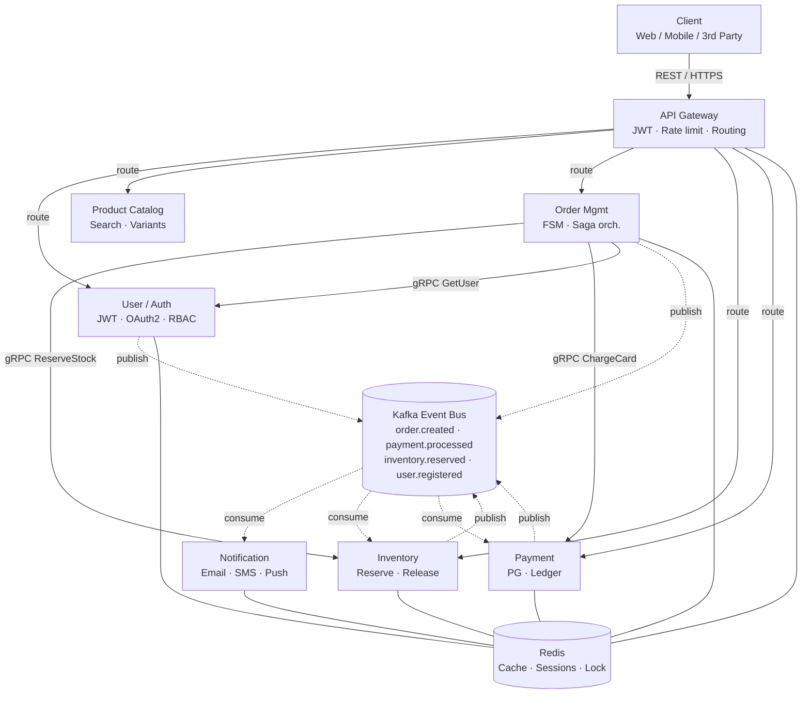
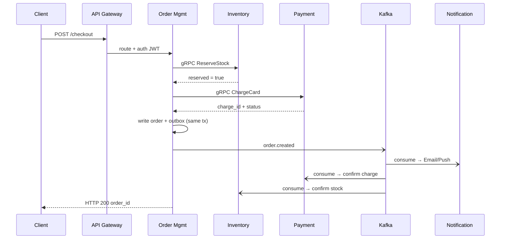
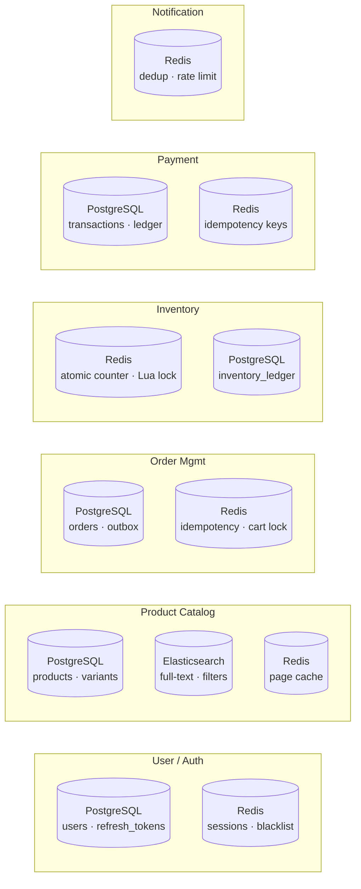

# Ecommerce Microservices Architecture

Fourteen services communicating via gRPC (sync) and Kafka (async), with Redis for caching, locking, and idempotency. Each service owns its own database — no cross-service joins.

> **Note (2026-07-01):** `cart-service`, `wishlist-service`, `review-return-service`, `promotions-service`, `settlement-service`, `logistics-service`, `analytics-service`, and `import-service` were added after the original six-service design below. All six business-facing ones now enforce JWT authentication (and role-based checks where relevant) on mutation routes — see `reviews/2026-07-01-new-services-review.md` for the original findings and the "Fixes Applied" addendum for what was fixed. Remaining gaps: no distributed tracing platform-wide, TLS not enforced by default on internal gRPC/Postgres/Kafka connections, and test coverage on these 8 services is still thin.

---

## Overview


```mermaid
flowchart TD
    Client["Client\nWeb / Mobile / 3rd Party"]

    GW["API Gateway\nJWT · Rate limit · Routing"]

    US["User / Auth\nJWT · OAuth2 · RBAC"]
    PC["Product Catalog\nSearch · Variants"]
    OM["Order Mgmt\nFSM · Saga orch."]
    INV["Inventory\nReserve · Release"]
    PAY["Payment\nPG · Ledger"]
    NOTIF["Notification\nEmail · SMS · Push"]

    KAFKA[("Kafka Event Bus\norder.created · payment.processed\ninventory.reserved · user.registered")]

    REDIS[("Redis\nCache · Sessions · Lock")]

    Client -->|REST / HTTPS| GW
    GW -->|route| US
    GW -->|route| PC
    GW -->|route| OM
    GW -->|route| INV
    GW -->|route| PAY

    OM -->|gRPC ReserveStock| INV
    OM -->|gRPC ChargeCard| PAY
    OM -->|gRPC GetUser| US

    OM -.->|publish| KAFKA
    PAY -.->|publish| KAFKA
    INV -.->|publish| KAFKA
    US -.->|publish| KAFKA

    KAFKA -.->|consume| NOTIF
    KAFKA -.->|consume| INV
    KAFKA -.->|consume| PAY

    GW --- REDIS
    US --- REDIS
    OM --- REDIS
    INV --- REDIS
    PAY --- REDIS
    NOTIF --- REDIS
```

---

## Services

### User / Auth
- Issues and validates JWTs (OAuth2 + password flows)
- RBAC roles stored per user
- Other services call it via gRPC to validate tokens in the hot path
- **DB:** PostgreSQL (`users`, `refresh_tokens`)
- **Cache:** Redis — session store, token blacklist

### Product Catalog
- Manages products, variants, categories, and pricing rules
- PostgreSQL as the source of truth; Debezium CDC syncs changes to Elasticsearch
- Redis caches catalogue listing pages
- **DB:** PostgreSQL (`products`, `variants`, `categories`)
- **Search:** Elasticsearch — full-text + faceted filters
- **Cache:** Redis — product page cache

### Order Management
- Owns the order lifecycle FSM: `pending → confirmed → shipped → delivered → cancelled`
- Acts as the saga orchestrator — calls Inventory and Payment via gRPC
- Writes to a transactional outbox table; Debezium CDC publishes events to Kafka
- **DB:** PostgreSQL (`orders`, `outbox`)
- **Cache:** Redis — idempotency keys, cart lock
- **Publishes:** `order.created`, `order.cancelled`

### Inventory
- Tracks stock per SKU and warehouse
- Reservations use atomic Lua scripts in Redis (`DECRBY` + guard) to prevent oversell
- PostgreSQL `inventory_ledger` is the durable audit trail
- Listens on `order.cancelled` to release reserved stock
- **DB:** PostgreSQL (`inventory_ledger`)
- **Cache:** Redis — atomic stock counters, distributed lock
- **Consumes:** `order.cancelled`
- **Publishes:** `inventory.reserved`, `inventory.updated`

### Payment
- Integrates with payment gateway (Razorpay / Stripe)
- All charges are idempotent — idempotency keys in Redis prevent double charges on retry
- Double-entry ledger rows written to PostgreSQL on each transaction
- **DB:** PostgreSQL (`transactions`, `ledger_entries`)
- **Cache:** Redis — idempotency keys
- **Consumes:** `order.created`
- **Publishes:** `payment.processed`, `payment.failed`

### Notification
- Purely event-driven — no REST endpoints exposed
- Stateless consumer; dispatches Email / SMS / Push via provider SDKs
- Redis handles per-user rate limiting and event deduplication
- **No primary DB**
- **Cache:** Redis — dedup keys, rate limit counters
- **Consumes:** `order.created`, `payment.processed`, `shipment.updated`

---

## Additional Services (added 2026-07-01)

### Cart
- Server-side cart for logged-in users; guest carts held in Redis and merged on login
- Calls Product Catalog via gRPC to check price/stock freshness
- **DB:** PostgreSQL (`cart_items`)
- **Cache:** Redis — guest cart storage
- **Status:** all mutation routes require a valid JWT (`pkg/crypto.RequireAuth`); user identity comes from the token, not a client header

### Wishlist
- Lets buyers save products/SKUs for later, and list/remove/clear their saved items
- **DB:** PostgreSQL (`wishlist_items`)
- **Status:** full CRUD wired behind auth; user identity comes from the token

### Review & Return
- Post-purchase product reviews (with `verified_purchase` derived from order history) and return/refund requests
- Approved returns call Logistics to create a reverse shipment
- A materialized view (`product_ratings`) aggregates published reviews per product for Product Catalog to read
- **DB:** PostgreSQL (`reviews`, `return_requests`, `return_items`, `product_ratings` matview)
- **Status:** creating a return requires auth (user_id comes from the token); approving/rejecting requires `admin`/`seller` role; approve/reject is now a single atomic status-guarded UPDATE

### Promotions
- Coupon codes and flash sales; validates and redeems coupons at checkout
- **DB:** PostgreSQL (`coupons`, `coupon_usage`)
- **Status:** validate/redeem require auth; redemption runs inside a transaction that locks the coupon row and re-checks usage limits, preventing over-redemption under concurrency

### Settlement
- Seller ledger, running balances, and payouts (via Razorpay payouts) net of commission/TDS/GST
- Consumes `payment.processed` / `payment.refunded` to credit/debit the seller ledger
- **DB:** PostgreSQL (`seller_ledger`, `seller_balances`, `seller_payouts`, `seller_bank_accounts`)
- **Consumes:** `payment.processed`, `payment.refunded`
- **Status:** balance/bank-account endpoints require the caller to be the seller or an admin; ledger writes are idempotent against Kafka redelivery (unique index on `payment_id, entry_type`); payouts use a pending→complete/fail flow so a crash mid-payout can't silently double-pay; the refund consumer is registered. Still open: Razorpay `fund_account_id` linking is a placeholder.

### Logistics
- Shipment assignment to delivery agents, tracking events, proof of delivery, COD reconciliation, and reverse (return) shipments
- Integrates with an external carrier (Shiprocket) via webhook
- **DB:** PostgreSQL (`shipments`, `tracking_events`, `delivery_agents`, `proof_of_delivery`, `cod_reconciliations`, `outbox`)
- **Publishes:** `shipment.delivered` (via outbox relay)
- **Status:** agent management requires `admin`; shipment assign/attempt/deliver require `admin`/`seller`; the Shiprocket webhook verifies an HMAC signature; the review-return-service→logistics-service reverse-shipment call is authenticated via a shared internal service token

### Analytics
- Ingests buyer behavior events (`view`, `cart_add`, `purchase`, `search`) for downstream reporting
- **DB:** PostgreSQL (`user_events`)
- **Status:** accepts both anonymous and authenticated events (`OptionalAuth`); an authenticated caller's `user_id` always comes from their token, never the request body; writes go through a bounded worker pool that drains on shutdown instead of an untracked goroutine per request

### Import
- Bulk product/category import for sellers: uploads a CSV to MinIO, a worker parses it and calls Product Catalog's `/categories/bulk` in batches of 100
- **DB:** PostgreSQL (`import_jobs`)
- **Status:** the batch-processing use case no longer discards `BulkCreateProducts`/`UpdateStatus` errors; the HTTP job-submission endpoints and MinIO wiring are still to be built

---

## Communication Patterns

### gRPC (synchronous, internal)

| Caller | Callee | RPC |
|--------|--------|-----|
| API Gateway | User / Auth | `ValidateToken` |
| Order Mgmt | Inventory | `ReserveStock` |
| Order Mgmt | Payment | `ChargeCard` |
| Order Mgmt | User / Auth | `GetUser` |

All proto definitions live in a shared `proto/` repo. Services generate client stubs at build time.

### Kafka topics

| Topic | Producer | Consumers |
|-------|----------|-----------|
| `order.created` | Order Mgmt | Payment, Notification, Inventory |
| `order.cancelled` | Order Mgmt | Inventory, Notification |
| `payment.processed` | Payment | Order Mgmt, Notification |
| `payment.failed` | Payment | Order Mgmt, Notification |
| `inventory.reserved` | Inventory | Order Mgmt |
| `inventory.updated` | Inventory | Analytics |
| `user.registered` | User / Auth | Notification |
| `payment.processed` | Payment | Settlement |
| `payment.refunded` | Payment | Settlement |
| `shipment.delivered` | Logistics | Order Mgmt, Notification |

Retention: 7 days minimum. Each service has its own consumer group.

---

## Checkout Saga Flow


```mermaid
sequenceDiagram
    participant C as Client
    participant GW as API Gateway
    participant O as Order Mgmt
    participant I as Inventory
    participant P as Payment
    participant K as Kafka
    participant N as Notification

    C->>GW: POST /checkout
    GW->>O: route + auth JWT
    O->>I: gRPC ReserveStock
    I-->>O: reserved = true
    O->>P: gRPC ChargeCard
    P-->>O: charge_id + status
    O->>O: write order + outbox (same tx)
    O-)K: order.created
    K-)N: consume → Email/Push
    K-)P: consume → confirm charge
    K-)I: consume → confirm stock
    O-->>C: HTTP 200 order_id
```

**Compensating transactions on failure:**
- Payment fails → Order publishes `order.cancelled` → Inventory releases reserved stock
- Inventory reservation fails → Order returns error immediately, no payment attempted

---

## Data Stores Per Service


```mermaid
flowchart LR
    subgraph User / Auth
        US_DB[("PostgreSQL\nusers · refresh_tokens")]
        US_CACHE[("Redis\nsessions · blacklist")]
    end

    subgraph Product Catalog
        PC_DB[("PostgreSQL\nproducts · variants")]
        PC_ES[("Elasticsearch\nfull-text · filters")]
        PC_CACHE[("Redis\npage cache")]
    end

    subgraph Order Mgmt
        OM_DB[("PostgreSQL\norders · outbox")]
        OM_CACHE[("Redis\nidempotency · cart lock")]
    end

    subgraph Inventory
        INV_CACHE[("Redis\natomic counter · Lua lock")]
        INV_DB[("PostgreSQL\ninventory_ledger")]
    end

    subgraph Payment
        PAY_DB[("PostgreSQL\ntransactions · ledger")]
        PAY_CACHE[("Redis\nidempotency keys")]
    end

    subgraph Notification
        N_CACHE[("Redis\ndedup · rate limit")]
    end
```

### Store assignments

| Service | Primary DB | Secondary |
|---------|-----------|-----------|
| User / Auth | PostgreSQL | Redis (sessions, blacklist) |
| Product Catalog | PostgreSQL | Elasticsearch, Redis |
| Order Mgmt | PostgreSQL | Redis (idempotency, cart lock) |
| Inventory | PostgreSQL | Redis (atomic counters, Lua lock) |
| Payment | PostgreSQL | Redis (idempotency keys) |
| Notification | None | Redis (dedup, rate limit) |

**Rule:** No service reads another service's database directly. Cross-service data access goes through gRPC or Kafka only.

---

## Redis Usage Breakdown

Redis is a shared cluster with per-service keyspace prefixes to avoid collisions.

| Use case | Service | Pattern |
|----------|---------|---------|
| JWT session store | User / Auth | `SET auth:session:{token} {payload} EX 3600` |
| Token blacklist | User / Auth | `SET auth:blacklist:{jti} 1 EX {ttl}` |
| Idempotency keys | Order, Payment | `SET {svc}:idem:{key} {result} EX 86400 NX` |
| Atomic stock reserve | Inventory | Lua script: `DECRBY inv:stock:{sku} qty` with guard |
| Distributed lock | Inventory | Redlock on `inv:lock:{sku}` |
| Product page cache | Product | `SET product:page:{id} {json} EX 300` |
| Cart data | Order | `HSET order:cart:{user_id} {items}` |
| Notification dedup | Notification | `SET notif:dedup:{event_id} 1 EX 3600 NX` |

---

## API Gateway

- Single public ingress — no service is directly internet-reachable
- Validates JWT on every request (gRPC call to User / Auth or local Redis cache of valid tokens)
- Per-user and per-IP rate limiting via Redis counters
- Routes by path prefix: `/users/*` → User, `/products/*` → Product, `/orders/*` → Order
- Can be implemented with Kong, Envoy, or Nginx + Lua

---

## Project Structure (Go monorepo)

```
/
├── proto/                        # Shared .proto definitions
│   ├── user/v1/user.proto
│   ├── inventory/v1/inventory.proto
│   └── payment/v1/payment.proto
│
├── services/
│   ├── user/
│   │   ├── cmd/main.go
│   │   ├── internal/
│   │   │   ├── handler/          # gRPC handlers
│   │   │   ├── repository/       # DB layer
│   │   │   └── service/          # Business logic
│   │   └── Dockerfile
│   ├── product/
│   ├── order/
│   ├── inventory/
│   ├── payment/
│   └── notification/
│
├── pkg/                          # Shared libraries
│   ├── kafka/                    # Producer / consumer wrappers
│   ├── redis/                    # Redis client + helpers
│   ├── middleware/               # JWT validation, logging
│   └── errors/                  # Domain error types
│
├── infra/
│   ├── docker-compose.yml        # Local dev stack
│   └── k8s/                     # Kubernetes manifests
│
└── Makefile
```

---

## Key Design Decisions

**Transactional outbox over direct Kafka publish**
Order and Payment write events to an `outbox` table in the same DB transaction as the business write. Debezium reads the outbox via CDC and publishes to Kafka. This guarantees no lost events even if the Kafka call fails mid-flight.

**Lua scripts for inventory reservation**
A Redis Lua script does the check-and-decrement atomically on a single Redis node, avoiding the race condition of a separate GET + DECRBY. PostgreSQL is updated asynchronously as the ledger of record.

**Idempotency keys everywhere**
Payment and Order endpoints require a client-supplied `Idempotency-Key` header. The result is cached in Redis with a 24-hour TTL. Duplicate requests return the cached response without re-executing.

**No shared databases**
Every service owns its schema. Cross-service data needs go through gRPC (sync) or Kafka events (async). This keeps deployment, scaling, and failure domains fully independent.
