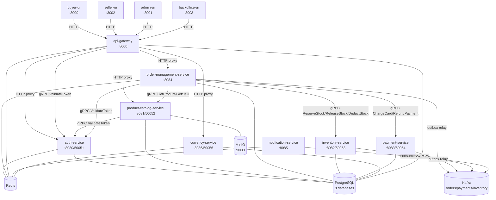
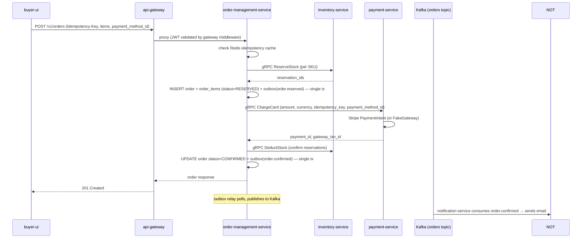

# ZapMarket Developer Guide

Last updated: 2026-06-29. Code is the source of truth; this doc summarises
what's actually implemented.

---

## Table of contents

1. [Architecture overview](#1-architecture-overview)
2. [Local setup](#2-local-setup)
3. [Database schemas](#3-database-schemas)
4. [Key event flows](#4-key-event-flows)
5. [Auth and authorisation](#5-auth-and-authorisation)
6. [Running tests](#6-running-tests)
7. [Adding a new endpoint](#7-adding-a-new-endpoint)
8. [Known gaps and rough edges](#8-known-gaps-and-rough-edges)

---

## 1. Architecture overview

ZapMarket is a Go monorepo managed with `go.work`. Each service is an
independent module under `services/`. Shared packages live in `pkg/`.

### Service map



### Communication rules

- **gRPC** — all synchronous inter-service calls. Auth validation is always
  gRPC to auth-service. Order-management calls inventory, payment, and catalog
  over gRPC during checkout.
- **Kafka** — async events after state transitions. Three topics:
  `orders`, `payments`, `inventory`. Produced via a transactional outbox
  (same DB transaction as the status change); drained by a polling relay
  goroutine in each producer service.
- **HTTP** — no direct service-to-service HTTP. All frontend traffic goes
  through api-gateway. Payment webhooks are the exception (Stripe → payment-service
  HTTP endpoint directly).
- **No cross-service DB access** — each service owns exactly one database.

---

## 2. Local setup

### Prerequisites

- Docker + Docker Compose
- Go 1.22+
- Node 20+ (for UI services)

### Start all infrastructure and services

```bash
docker compose up -d
```

This starts PostgreSQL, Kafka, Redis, MinIO (with `zapmarket` bucket
auto-created), all Go services, all four Next.js UIs, Prometheus, Grafana,
Loki, and supporting tools. First boot runs `docker-entrypoint-initdb.d/init.sql`
which creates the eight databases.

Each Go service runs `MIGRATE_ON_BOOT=true` by default, so migrations apply
automatically on startup. To disable: set `MIGRATE_ON_BOOT=false`.

### Run a single service locally (outside Docker)

```bash
# auth-service
cd services/auth-service
cp .env.example .env   # edit credentials
go run ./cmd/...

# product-catalog-service (entrypoint is main.go at root)
cd services/product-catalog-service
go run .
```

Requires PostgreSQL running and the target database to exist. The easiest
approach is `docker compose up postgres -d` and letting `MIGRATE_ON_BOOT`
handle schema setup.

### Ports reference

| Service | HTTP | gRPC | UI / Tool |
|---|---|---|---|
| api-gateway | 8000 | — | — |
| auth-service | 8080 | 50051 | — |
| product-catalog-service | 8081 | 50052 | — |
| inventory-service | 8082 | 50053 | — |
| payment-service | 8083 | 50054 | — |
| order-management-service | 8084 | — | — |
| notification-service | 8085 | — | — |
| currency-service | 8086 | 50056 | — |
| buyer-ui | — | — | localhost:3000 |
| admin-ui | — | — | localhost:3001 |
| seller-ui | — | — | localhost:3002 |
| backoffice-ui | — | — | localhost:3003 |
| Kafka UI | — | — | localhost:8090 |
| Prometheus | — | — | localhost:9090 |
| Grafana | — | — | localhost:3009 (admin/zapmarket) |
| pgAdmin | — | — | localhost:5050 (admin@zapmarket.com/admin) |
| MinIO console | — | — | localhost:9001 (minioadmin/minioadmin) |
| RedisInsight | — | — | localhost:5540 |

### Key environment variables

All services use `pkg/config/config.go`. The notable service-specific ones:

**auth-service** (see `services/auth-service/.env.example`):
- `RESEND_API_KEY` — email via Resend; falls back to SMTP, then log-only
- `SMTP_HOST`, `SMTP_USER`, `SMTP_PASSWORD`, `SMTP_FROM` — SMTP fallback
- `TWILIO_ACCOUNT_SID`, `TWILIO_AUTH_TOKEN`, `TWILIO_FROM_NUMBER` — SMS; falls back to log-only
- `OAUTH2_GOOGLE_CLIENT_ID/SECRET`, `OAUTH2_FACEBOOK_CLIENT_ID/SECRET` — OAuth (disabled without these)
- `JWT_SECRET_KEY`, `JWT_REFRESH_SECRET_KEY` — must be set in production

**payment-service**:
- `STRIPE_SECRET_KEY` — enables Stripe; without it, `FakePaymentGateway` is used
- `STRIPE_WEBHOOK_SECRET` — required for webhook signature verification

**buyer-ui**:
- `NEXT_PUBLIC_STRIPE_PUBLISHABLE_KEY` — enables the Stripe card element in checkout

**product-catalog-service**:
- `MINIO_ENDPOINT`, `MINIO_ACCESS_KEY`, `MINIO_SECRET_KEY`, `MINIO_BUCKET`

---

## 3. Database schemas

Each service owns one PostgreSQL database. Migrations live in
`services/<name>/migrations/` and run in numeric order.

### `userauth` (auth-service)

Key tables:

| Table | Purpose |
|---|---|
| `users` | Core user record: id, email, phone, password_hash, role (`buyer`/`seller`/`admin`), is_verified, registration_step (0–4), dob, gender, pfp_url, phone_verified, terms_accepted_at |
| `oauth_accounts` | Links a user to a provider+provider_uid pair (Google, Facebook) |
| `refresh_tokens` | Hashed refresh tokens with expiry and revocation timestamp |
| `addresses` | User delivery addresses; `is_default` flag |
| `seller_profiles` | One row per seller: store_name, category, gstin, pan, business_phone, city, pincode, plus extended business address fields |
| `otp_verifications` | OTP codes (hashed), purpose enum, used_at |
| `password_reset_tokens` | Hashed one-time reset tokens |
| `notification_preferences` | Per-user channel+event_type enable/disable |

`registration_step` values: `1` = basic info saved, `2` = (reserved),
`3` = profile saved, `4` = complete. Existing accounts default to `4`.
Login is blocked for steps 1–3.

### `productcatalog` (product-catalog-service)

| Table | Purpose |
|---|---|
| `categories` | Self-referential tree (parent_id); seeded from `amazon-in-categories.csv` |
| `products` | Product record; `seller_id` is a UUID from auth-service (no FK across DBs); `attributes` is JSONB; status: `DRAFT`/`ACTIVE`/`INACTIVE`/`ARCHIVED` |
| `skus` | One SKU per variant; `price_amount` in smallest currency unit; `variant_attrs` JSONB |
| `product_images` | Ordered images per product/SKU; `url` points to MinIO |

### `ordermgmt` (order-management-service)

| Table | Purpose |
|---|---|
| `orders` | One row per checkout attempt; `idempotency_key` is the client-supplied UUID; status: `PENDING`→`RESERVED`→`PAID`→`CONFIRMED`/`CANCELLED` |
| `order_items` | Line items: sku_id, quantity, unit_price, reservation_id |
| `outbox` | Transactional outbox — `order.reserved`, `order.confirmed`, `order.cancelled` events written in the same transaction as status changes |

### `inventory` (inventory-service)

| Table | Purpose |
|---|---|
| `warehouses` | Physical locations; a single default warehouse is seeded |
| `inventory` | Stock per SKU per warehouse: qty_on_hand, qty_reserved, qty_available (generated column) |
| `inventory_ledger` | Immutable append-only record of every stock movement |
| `inventory_reservations` | Active reservations tied to an order; status: `RESERVED`/`CONFIRMED`/`RELEASED`; expires_at enforced by application |

### `payment` (payment-service)

| Table | Purpose |
|---|---|
| `payments` | One row per charge attempt; `gateway` field records `stripe` or `fake`; status: `PENDING`/`AUTHORISED`/`CAPTURED`/`FAILED`/`REFUNDED` |
| `ledger_entries` | Double-entry bookkeeping: every payment produces debit + credit rows |
| `refunds` | Refund records linked to a captured payment |
| `outbox` | `payment.captured`, `payment.failed`, `payment.refunded` events |

### `currency` (currency-service)

| Table | Purpose |
|---|---|
| `currencies` | Currency metadata + `enabled` flag |
| `exchange_rates` | Latest rate per (base, quote) pair; refreshed from Frankfurter API |
| `exchange_rates_history` | Historical snapshot per fetch cycle |

### `apigateway` (api-gateway)

| Table | Purpose |
|---|---|
| `gateway_routes` | `path_prefix`, `upstream` URL, `auth_mode` (`none`/`required`/`method_split`), `strip_prefix`; Postgres LISTEN/NOTIFY triggers hot reload |
| `gateway_audit_log` | Per-request log: method, path, upstream, status_code, user_id |

---

## 4. Key event flows

### 4a. Checkout saga



**Compensation path**: if `ChargeCard` fails, `CancelOrder` calls
`ReleaseStock` on inventory and writes `order.cancelled` to the outbox.
If `DeductStock` fails after a successful charge, `RefundPayment` is called
before cancelling.

### 4b. Notification delivery

notification-service runs three concurrent Kafka consumers (topics:
`orders`, `payments`, `inventory`). For each message it:

1. Reads `event_type` and `outbox_id` headers
2. Claims a Redis dedup key (`notif:dedup:<outbox_id>`, TTL 72h) — skips if already claimed
3. Matches against `notifTemplates` map (6 templates: `order.confirmed`,
   `order.cancelled`, `payment.captured`, `payment.failed`, `payment.refunded`,
   `inventory.depleted`)
4. Calls the configured notifier (`SMTPNotifier` or `LogNotifier`)

**Known gap**: the notification-service receives `user_id` in the payload
but has no mechanism to look up the user's email address. `LogNotifier` just
logs the user ID. `SMTPNotifier` would attempt to send to `user_id` as the
address, which is not a real email. End-to-end email delivery from Kafka
events is not yet wired up.

---

## 5. Auth and authorisation

### Token issuance

auth-service issues:
- **Access token** — JWT, 1h expiry by default (`JWT_ACCESS_EXPIRY_HOURS`).
  Claims: `sub` (user ID), `email`, `role`, `is_verified`, `exp`.
- **Refresh token** — opaque random string, stored as SHA-256 hash in
  `refresh_tokens`. Default 7-day expiry.

buyer-ui stores the access token in an `httpOnly` cookie named `buyer_token`.

### Token validation (inter-service)

Services do **not** validate JWTs locally. They call
`auth-service gRPC ValidateToken` which returns the user's claims.
This is implemented in each service's `internal/middleware/auth.go`.

Exception: api-gateway validates the token itself via the same gRPC call
and sets downstream request headers (`X-User-ID`, `X-User-Role`) for
proxied services.

### RBAC

Three roles: `buyer`, `seller`, `admin`. The `RequireRole` middleware helper
chains after `Authenticate`:

- **product-catalog-service**: write endpoints (create/update/delete product,
  SKU, image) require role `seller`. Admin endpoints require `admin`.
- **order-management-service**: `/v1/orders/seller/*` requires `seller`.
  Admin endpoints require `admin`.
- **currency-service**: `ToggleCurrency` requires `admin`.

### Registration wizard

New users are created with `registration_step=1`. Login returns
`REGISTRATION_INCOMPLETE` (HTTP 400) for steps 1–3. The four steps are:

1. `POST /v1/auth/register` — creates user, issues tokens
2. `POST /v1/auth/otp/verify` + `POST /v1/auth/phone-otp/verify` — verify email and phone
3. `PATCH /v1/auth/registration/profile` — DOB (age ≥ 18 enforced), gender, address, profile picture, seller store details
4. `POST /v1/auth/registration/complete` — accept terms, sets `registration_step=4`

Profile pictures are uploaded to `POST /v1/auth/profile/picture` (multipart),
stored at `./uploads/pfp/` on disk, served at `/v1/auth/pfp/<filename>`.

### OAuth

Google and Facebook OAuth flows live in auth-service's `OAuthService`.
Disabled (config validation fails silently) if client credentials are absent.
OAuth users skip the password registration step and default to
`registration_step=4`.

### Admin bootstrap

`POST /v1/auth/admin/bootstrap` creates the first admin account. Fails with
409 if any admin already exists.

---

## 6. Running tests

Tests exist for: auth-service (service layer + preferences handler),
product-catalog-service (category + product service), order-management-service
(order service), payment-service (payment service), inventory-service
(inventory service), notification-service (consumer handler), and
currency-service (use-cases + domain conversion + fallback provider).

All tests use in-process fakes — no real DB or Kafka required.

```bash
# Run tests for one service
cd services/auth-service
go test ./...

# Run all tests from workspace root
go test ./services/.../...
```

No integration test suite exists. No UI tests exist.

---

## 7. Adding a new endpoint

Follow the existing pattern from product-catalog-service (uses chi) or
auth-service (uses stdlib ServeMux):

**1. Domain model** — add struct to `internal/domain/models.go`

**2. Repository interface** — add method to `internal/domain/contracts/repositories.go`;
implement in `internal/repository/`

**3. Service** — add method to `internal/service/`; the interface contract
lives in the service package (or `internal/domain/contracts/`)

**4. Handler** — add method to `internal/handler/http/`. Use `h.writeResponse`
/ `h.writeError` (base.go) for consistent JSON. Add Swagger annotations.

**5. Route** — register in `main.go` (auth-service) or the chi router block
(product-catalog-service / order-management-service). Auth-gated routes must
go inside the `AuthMiddleware` group.

**6. Gateway route** — insert a row into `gateway_routes` so api-gateway
proxies the new prefix. The router hot-reloads via Postgres LISTEN/NOTIFY.

**7. Regenerate Swagger** (from service root):
```bash
# auth-service
swag init -g cmd/main.go
# product-catalog-service or order-management-service
swag init -g main.go
```

### Adding a new service

Use `docs/service-template.md` as the starting point. Key checklist:
- Add module to `go.work`
- Create database in `docker-entrypoint-initdb.d/init.sql`
- Add service block to `docker-compose.yml`
- Add at least one `gateway_routes` row for the service
- Follow the layered structure: `domain/` → `repository/` → `service/` → `handler/`
- Use `pkg/config` for config loading, `pkg/migrate` for migrations,
  `pkg/logger` for structured logging, `pkg/metrics` for Prometheus,
  `pkg/grpcx` for the gRPC server

---

## 8. Known gaps and rough edges

| Area | Status |
|---|---|
| Notification email delivery | notification-service receives `user_id` but has no user lookup; SMTP delivery to real addresses is not wired end-to-end |
| Debezium / CDC | Not deployed; outbox is drained by a polling `pkg/relay` goroutine in each service; Kafka is live but relies on polling not CDC |
| Inventory HTTP API | No public HTTP endpoints; stock management is gRPC-only (no seller-facing stock UI wired up) |
| Multi-warehouse routing | Schema supports multiple warehouses; all stock operations currently target the single seeded default warehouse |
| GST / tax calculation | `payment_taxes` table exists; no logic populates it |
| SMS OTP in production | Twilio is wired; falls back to log-only without `TWILIO_ACCOUNT_SID` |
| OAuth (Google/Facebook) | Implemented; requires OAuth app credentials to activate |
| seller-ui and backoffice-ui | Pages exist; end-to-end API wiring not fully verified |
| Profile pictures | Stored on local disk (`./uploads/pfp/`); not backed by MinIO; not suitable for multi-instance deployment |
| `registration_step=2` | Step value 2 is currently skipped (step jumps 1→3); reserved for future use |
